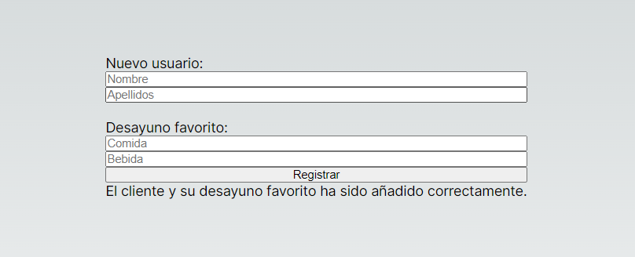
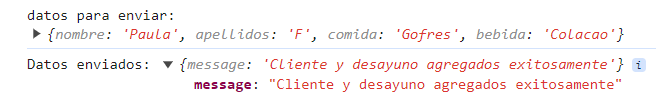
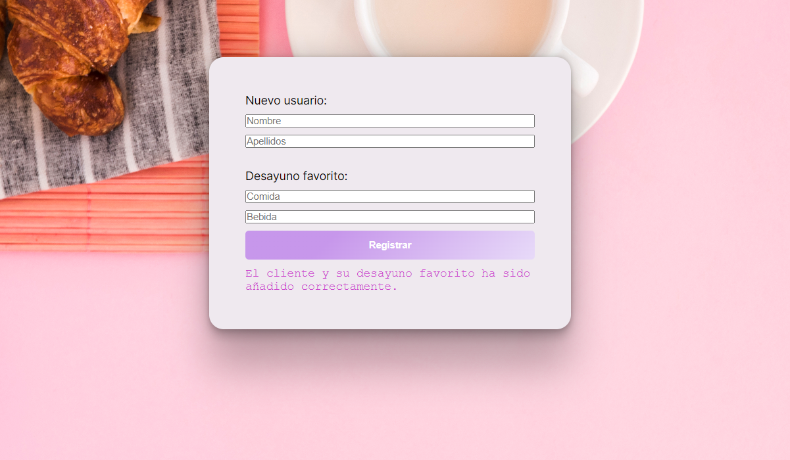

# the_best_breakfast_project

**Esqueleto inicial**

**Mensaje reflejado en consola:**

**Ejemplo feedback al usuario**

**Fuentes**
Imagen fondo: 
<a href="https://www.freepik.es/foto-gratis/desayuno_4254372.htm#fromView=search&page=1&position=31&uuid=4c9c9ad0-9dda-4520-8dc4-15cc35946e98">Imagen de freepik</a>
Estilo botón registrar: https://markodenic.com/tools/buttons-generator/
Estilo card: https://getcssscan.com/css-box-shadow-examples