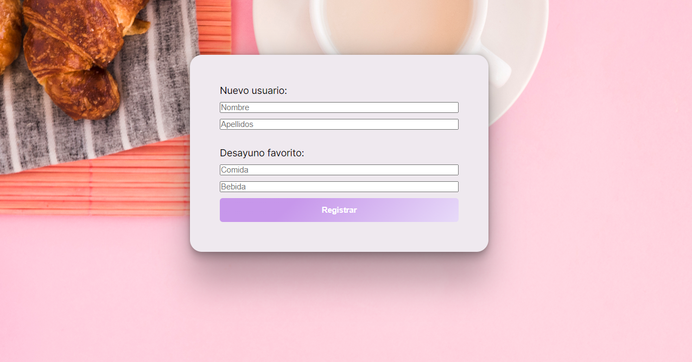

# The best breakfast project

*Conocimientos Técnicos implementados:* *

Lenguajes de Programación: JavaScript y SQL.
Herramientas y Librerías: Node.js, Express, React, Axios, React Router, MySQL, y Docusaurus.
Conceptos de Desarrollo Web: RESTful APIs, manejo de estado, autenticación.

**Esqueleto inicial**

**Mensaje reflejado en consola:**

**Ejemplo feedback al usuario**

* *Desglose de conocimientos aplicados*

**1. Configuración de la Base de Datos (MySQL)**

Modelado de Datos: Diseño de tablas y relaciones que representan las entidades de la aplicación.
SQL: Uso de lenguaje SQL para crear, modificar y consultar la base de datos.
Gestión de la Base de Datos: Instalación y configuración de MySQL.
Conexión y Operaciones CRUD: Implementación de operaciones CRUD (Create, Read, Update, Delete) para interactuar con la base de datos desde el backend.

**2. Backend (Node.js y Express)**

Configuración del Servidor: Instalación y configuración de un servidor Node.js con Express para manejar solicitudes HTTP.
Creación de Endpoints: Diseño e implementación de endpoints RESTful que permitan al frontend interactuar con la base de datos.

**3. Frontend (React)**

Configuración de la Aplicación: Creación de la estructura de la aplicación.
Componentización: Diseño de componentes React reutilizables y manejo del estado de la aplicación con hooks como useState.
Consumo de APIs: Uso de axios para hacer solicitudes HTTP a los endpoints creados en el backend.
Rutas y Navegación: Implementación de rutas dentro de la aplicación usando React Router.

**PRUEBAS EN POSTMAN**

**4. Documentación (Docusaurus)**

Instalación y Configuración: Instalación de Docusaurus y configuración inicial para la documentación.

**Fuentes**
Imagen fondo: 
<a href="https://www.freepik.es/foto-gratis/desayuno_4254372.htm#fromView=search&page=1&position=31&uuid=4c9c9ad0-9dda-4520-8dc4-15cc35946e98">Imagen de freepik</a>
Estilo botón registrar: https://markodenic.com/tools/buttons-generator/
Estilo card: https://getcssscan.com/css-box-shadow-examples

